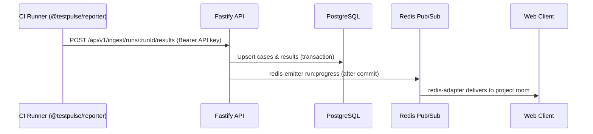

# Universal Documentation Implementation Standards for TestPulse

Every architectural change, API contract, and completed feature sprint must be documented in the repository before a pull request can be merged or a sprint story closed.

---

### 1. Required Documentation Directory Structure

Maintain the repository `docs/` structure. Sprint files reference these exact paths:

- **`docs/product/`**: PRD (`prd.md`), personas and journeys, glossary (`glossary.md`), plan limits rationale.
- **`docs/architecture/`**: System overview (`overview.md`), module boundaries, data flows, and Architecture Decision Records (`adr-XXX-<title>.md`).
- **`docs/api/`**: REST contracts (`rest-api.md`), ingestion protocol (`ingestion.md`), WebSocket event dictionary (`realtime-events.md`), error codes. Generated OpenAPI output is linked, not duplicated.
- **`docs/database/`**: Prisma schema notes, ER diagram (`schema.md`), indexing strategy, and migration guides.
- **`docs/security/`**: Security model (`security-model.md`), RBAC matrix (`rbac-matrix.md`), threat model, audit reports.
- **`docs/testing/`**: Test strategy (`testing-strategy.md`), coverage audits, performance baselines, and pre-implementation test case catalogs (`test_cases_catalog_PXX_SYY.md`).
- **`docs/ux/`**: Information architecture, wireframes, design system tokens, and accessibility notes.
- **`docs/ops/`**: Environment variable catalog (`environment.md`), deployment runbooks, release plans, and disaster recovery.
- **`docs/integrations/`**: Setup documentation for `@testpulse/reporter`, GitHub Actions, and webhooks.
- **`docs/walkthroughs/`**: One walkthrough per completed code sprint (`walkthrough-PXX-SYY.md`).
- **`docs/launch/`**: GTM and launch materials (Phase 11).

Customer-facing documentation (quickstart, guides, API reference) lives in the docs portal under `apps/web` (Phase 11). It may source content from `docs/integrations/`.

---

### 2. Standardized Templates

#### A. Architecture Decision Record (ADR) Template
Save to `docs/architecture/adr-XXX-<title>.md`:

```markdown
# ADR-001: [Title of Decision]

## Status
[Proposed | Accepted | Superseded | Deprecated]

## Context
[What is the business or technical context driving this decision?]

## Decision
[What architecture or technology decision was made?]

## Consequences
- **Positive:** [What benefits are gained?]
- **Negative / Trade-offs:** [What compromises or complexities are introduced?]
- **Mitigation:** [How will the trade-offs be managed?]
```

#### B. Pre-Implementation Test Cases Catalog Template
Save to `docs/testing/test_cases_catalog_PXX_SYY.md`:

```markdown
# Test Cases Catalog: Phase XX — Sprint YY ([Sprint Title])

## 1. Positive Test Scenarios (Happy Path)
- [ ] **TC-P01:** [Description of valid operation and expected outcome]
- [ ] **TC-P02:** [Description of valid operation and expected outcome]

## 2. Negative Test Scenarios (Error Handling)
- [ ] **TC-N01:** [Invalid payload triggers Zod 400 Bad Request]
- [ ] **TC-N02:** [Missing or expired JWT triggers 401 Unauthorized]

## 3. Boundary & Edge Case Scenarios
- [ ] **TC-B01:** [Empty list / 0 items returns 200 with empty array]
- [ ] **TC-B02:** [Batch payload at maximum threshold (10,000 items)]

## 4. Multi-Tenant Security Scenarios
- [ ] **TC-S01:** [Tenant A cannot read Tenant B test runs (404)]
- [ ] **TC-S02:** [Viewer cannot quarantine a test in their own org (403)]
- [ ] **TC-S03:** [Project API key cannot access organization membership endpoints (401)]
```

#### C. Sprint Walkthrough Template
Save to `docs/walkthroughs/walkthrough-PXX-SYY.md`:

```markdown
# Sprint Walkthrough: Phase XX — Sprint YY ([Sprint Title])

## 1. Feature Purpose
[Brief summary of what problem was solved and for whom]

## 2. Changed Behavior
- [Component/Module]: [What changed]
- [API/Route]: [New or modified endpoints]

## 3. Verification Steps
1. Run command: `npm run test`
2. Expected output: [Describe observed test results]

## 4. Executed Tests & Real Results
- Test Suite: `apps/api/test/ingestion.spec.ts`
- Tests Run: 14 passed, 0 failed
- Duration: 1.24s

## 5. Known Limitations & Deferred Work
- [Any edge cases explicitly deferred to future sprints]
```

---

### 3. Mandatory Discipline: No Fake Artifacts

Do NOT generate irrelevant, placeholder, or fabricated documentation:
- Do not document database models or fields that do not exist in the Prisma schema.
- Do not publish performance benchmarks or test reports without real, measured command outputs.
- Ensure all API documentation matches the actual Zod validation schemas in `@testpulse/shared`.

---

### 4. Technical Documentation Best Practices

- **Code Blocks:** Always provide language tags (`typescript`, `json`, `bash`, `powershell`, `prisma`, `mermaid`).
- **Native Mermaid Diagrams:** Use Mermaid diagrams for architecture, sequence flows, and state machines:



- **Relative Links:** Use relative markdown links so links resolve correctly in GitHub and local editors.
