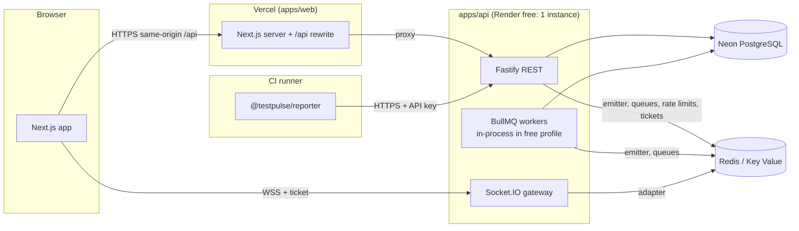

# System Architecture Overview

> **Sprint:** P01-S03 · **Owner:** `role-fullstack-architect` · **Status:** Draft for review (2026-10)
> Canonical contracts are in the [master plan](../../planning/master/TestPulse_Master_Plan.md) (§3–§8). Decisions are recorded as ADRs (index below).

## 1. Packages and boundaries

| Workspace | Kind | May import | Must not import | Notes |
| :--- | :--- | :--- | :--- | :--- |
| `apps/web` (`@testpulse/web`) | Next.js 16 app | `shared`, `ui` | `db`, Node-only modules in client code | App, marketing, and docs portal. Calls the API through the same-origin `/api` path |
| `apps/api` (`@testpulse/api`) | Fastify 5 service | `shared`, `db` | `ui` | `server.ts` (REST + Socket.IO gateway) and `worker.ts` (`startWorkers()` for BullMQ) |
| `packages/shared` | Library (isomorphic) | — | `apps/*`, `db`, `ui`, Node built-ins | Zod schemas, inferred types, event contracts, permission map, plan limits, fingerprint, and pure algorithms (flaky, quarantine state machine) |
| `packages/db` | Library (server) | — | `apps/*`, `ui` | Prisma schema, migrations, `createTenantDb`, `systemDb`, test DB harness |
| `packages/ui` | Library (React) | — | `apps/*`, `db` | Radix + Tailwind primitives, design tokens |
| `packages/reporter` | Published npm package | `shared` (**bundled at build**) | everything else | Playwright + Vitest reporters; runtime deps limited to runner peers |

Boundaries are enforced by ESLint (`eslint-plugin-boundaries` + `no-restricted-imports`) from P02-S04.

## 2. Processes and deployment



| Process | Responsibilities | Scaling (paid profile) | Free profile |
| :--- | :--- | :--- | :--- |
| Web | SSR/RSC pages, `/api` rewrite, static assets | Vercel managed | Vercel Hobby |
| API server | REST, auth, ingestion, Socket.IO gateway | N stateless instances; sticky sessions or websocket-only | 1 instance, sleeps when idle |
| Worker | Flaky analysis, SLA monitor, reaper, retention, aggregation, notifications, email, webhooks | M instances, queue-based | In-process (`RUN_WORKERS_IN_PROCESS=true`) |
| PostgreSQL | System of record | Neon paid with PITR | Neon free |
| Redis | Socket.IO adapter/emitter, BullMQ, rate limits, socket tickets | Persistent fixed-price Redis | Render Key Value free (non-persistent) |

## 3. Key data flows

### 3.1 Ingestion → live dashboard

```mermaid
sequenceDiagram
  participant CI as Reporter (shard k)
  participant API as Fastify
  participant DB as PostgreSQL
  participant RE as Redis
  participant GW as Gateway(s)
  participant B as Browsers
  CI->>API: POST /ingest/runs (externalRunId, shard k/n)
  API->>DB: find-or-create run (unique projectId+externalRunId)
  API-->>RE: emit run:started (only if created)
  loop every ~1s / 200 results
    CI->>API: POST /ingest/runs/:id/results (batch ≤ 1,000)
    API->>DB: upsert suites/cases/results, counters (1 tx)
    API-->>RE: emit run:progress (after commit)
    RE-->>GW: adapter fan-out
    GW-->>B: run:progress (room project:{id})
  end
  CI->>API: POST /ingest/runs/:id/complete (shard k)
  API->>DB: mark shard done; if all done → final status
  API-->>RE: emit run:completed · enqueue flaky-analysis + domain events
```

### 3.2 Domain events → notifications and webhooks

```text
Producers (after commit): ingestion (run.failed/recovered, test.new_failure), flaky analysis (test.flaky_detected),
quarantine API (quarantine.created/closed), SLA job (quarantine.sla_warning/escalated/overdue), annotations (annotation.mentioned),
invitations (member.invited)
        │  BullMQ queue "domain-events" (job data: Zod-validated envelope with orgId/projectId)
        ▼
Consumers (Phase 07): notification router → Notification rows + notification:new + email jobs (preferences, digests)
                      webhook dispatcher  → WebhookDelivery jobs (signed, SSRF-safe, retries)
```

### 3.3 Scheduled jobs (all catch-up safe)

| Job | Schedule (UTC) | Selects work by | Sprint |
| :--- | :--- | :--- | :--- |
| Stale-run reaper | every 5 min | `status = RUNNING AND lastActivityAt < now − 30 min` | P04-S06 |
| Retention | daily 02:00 | `createdAt < now − effectiveRetention` (chunked) | P04-S06 |
| SLA monitor | every 15 min | `open AND slaDueAt-based thresholds AND marker IS NULL` | P06-S05 |
| Aggregation reconciliation | daily 00:15 | the previous UTC day | P08-S01 |
| Digest sender | hourly / daily | pending digest items | P07-S03 |
| Notification cleanup | daily | read notifications older than 90 days | P07-S01 |

Repeatable jobs are registered idempotently at startup with deterministic job IDs (free Redis may lose them).

## 4. Failure modes

| Failure | Effect | Mitigation |
| :--- | :--- | :--- |
| API asleep / cold start (free) | First request takes ~30–60 s | Reporter 60 s first-request timeout plus buffering; web "waking" state |
| API instance crash mid-batch | The batch transaction rolls back | The reporter retries; upserts are idempotent |
| Redis restart (free, non-persistent) | Lost queued jobs, schedules, tickets, rate-limit counters | Re-register schedules at boot; jobs derive work from PostgreSQL state; clients get new tickets; domain events lost in the window are acceptable on staging only |
| Redis down | No real-time updates, queues paused, rate limiting unavailable | `/health` degraded; rate limiter fails **closed** for auth routes and **open** for ingestion (CI safety); clients fall back to polling |
| PostgreSQL unavailable or suspended | API errors (503) | Health check; reporter buffers and retries, then gives up silently; Neon autosuspend wake is handled by connection retry |
| Gateway restart | Sockets drop | Clients reconnect with backoff and jitter, then refetch |
| Abandoned CI job | Run stuck `RUNNING` | Reaper → `TIMED_OUT` |
| Duplicate delivery (retries, at-least-once queues) | Possible double side effects | Idempotency keys and markers everywhere (results, notifications, emails, webhooks, SLA) |

## 5. Environments

| Environment | Web | API | DB | Redis | Purpose |
| :--- | :--- | :--- | :--- | :--- | :--- |
| Local | `next dev` | `tsx watch` (+ in-process workers) | Native PostgreSQL or a personal Neon branch | Memurai/WSL Redis or `REDIS_URL` unset (unit tests only) | Development |
| Test (CI) | built app | built API | GitHub Actions service container, schema per worker | service container | Quality gates |
| Preview | Vercel preview per PR | shared staging API | staging | staging | UI review only |
| Staging (free) | Vercel Hobby | Render free | Neon free | Render Key Value free | Integration and demos (no real users) |
| Production (paid) | decided in P10-S06 | decided in P10-S06 | Neon paid (planned) | persistent Redis | Private beta onward |

Environment variables are cataloged in [`docs/ops/environment.md`](../ops/environment.md).

## 6. ADR index

| ADR | Title | Status |
| :--- | :--- | :--- |
| [ADR-001](adr-001-monorepo-tooling.md) | Monorepo tooling: npm workspaces + Turborepo 2 | Accepted |
| [ADR-002](adr-002-realtime-engine.md) | Real-time engine: Socket.IO with Redis emitter/adapter and ticket auth | Accepted |
| [ADR-003](adr-003-hosting-free-profile.md) | Hosting: free-tier profile during development | Accepted (paid amendment due in P10-S06) |
| [ADR-004](adr-004-dependency-baseline.md) | Dependency & runtime baseline | Accepted |
| [ADR-005](adr-005-auth-and-sessions.md) | Authentication & sessions (API-owned) | Accepted |
| [ADR-006](adr-006-tenant-isolation.md) | Tenant isolation enforcement (no RLS in v1) | Accepted |
| [ADR-007](adr-007-ingestion-protocol.md) | Incremental ingestion protocol & test fingerprints | Accepted |
