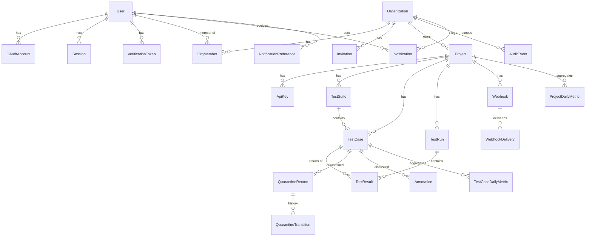

# Database Schema (Design)

> **Sprint:** P01-S03 (design) → implemented incrementally (P02-S03, P03, P04-S01, P06, P07, P08). Canonical entity list: master plan §5. This document adds relationships, constraints, cascade rules, and the isolation classification. Prisma 7.10 / PostgreSQL 16 (ADR-004).
> **Query plans** for the key queries are recorded here in P04-S01 from real `EXPLAIN ANALYZE` output. Do not add plans that were not measured.

## 1. Entity-relationship diagram

## 2. Isolation classification

| Class | Tables | Tenant key(s) | Access path |
| :--- | :--- | :--- | :--- |
| Global (identity) | `User`, `OAuthAccount`, `Session`, `VerificationToken` | — (scoped by `userId`) | `systemDb` inside the auth modules only |
| Org-scoped | `Organization`¹, `OrgMember`, `Invitation`, `Project`, `AuditEvent`, `Notification`² | `orgId` | `createTenantDb({ orgId })` |
| Project-scoped | `ApiKey`, `TestSuite`, `TestCase`, `TestRun`, `TestResult`, `QuarantineRecord`, `QuarantineTransition`, `Annotation`, `Webhook`, `WebhookDelivery`, `ProjectDailyMetric`, `TestCaseDailyMetric`, `NotificationPreference`³ | `projectId` (+ `orgId` via project) | `createTenantDb({ orgId, projectId })` |

¹ `Organization` is looked up by membership, never by a raw ID from the client alone.
² `Notification` is additionally filtered by `userId = current user`.
³ `NotificationPreference.projectId` is nullable (null = global for the user). It is filtered by `userId`, plus a membership check on `projectId`.

ApiKey lookup during authentication uses `systemDb` by `keyHash` (unique). This is the only pre-tenant read of a tenant table, and it is reviewed as such.

## 3. Constraints & indexes

| Table | Unique | Indexes | Notes |
| :--- | :--- | :--- | :--- |
| `User` | `email` (lower-cased on write) | — | `deletedAt` = anonymized |
| `OAuthAccount` | `(provider, providerAccountId)` | `userId` | |
| `Session` | `refreshTokenHash` | `(userId, revokedAt)`, `familyId` | |
| `VerificationToken` | `tokenHash` | `(userId, type)` | Deleted after use or expiry (cleanup job) |
| `Organization` | `slug` | — | `deletedAt` for soft delete |
| `OrgMember` | `(orgId, userId)` | `userId` | Exactly one OWNER per org (enforced in the service and a partial unique index `WHERE role = 'OWNER'`) |
| `Invitation` | `tokenHash` | `(orgId, email)` | Partial unique `(orgId, email) WHERE acceptedAt IS NULL AND revokedAt IS NULL` |
| `Project` | `(orgId, slug)` | `orgId` | `runCounter` incremented atomically |
| `ApiKey` | `keyHash` | `(projectId, revokedAt)` | `prefix` for display |
| `TestSuite` | `(projectId, filePath)` | — | |
| `TestCase` | `(projectId, identifier)` | `(projectId, flakyState)`, `(projectId, isQuarantined)`, `suiteId`, trigram on `title` (if chosen in P04-S04) | |
| `TestRun` | `(projectId, runNumber)`, `(projectId, externalRunId)` | `(projectId, createdAt)`, `(projectId, branch, createdAt)`, `(status, lastActivityAt)` | |
| `TestResult` | `(runId, testCaseId)` | `(runId, status)`, `(testCaseId, createdAt)`, `(projectId, createdAt)` | Highest-volume table |
| `QuarantineRecord` | partial `(testCaseId) WHERE status IN ('ACTIVE','INVESTIGATING')` | `(projectId, status)`, `(status, slaDueAt)` | Partial index created in raw SQL migration |
| `QuarantineTransition` | — | `(quarantineId, createdAt)` | Append-only |
| `Annotation` | — | `(testCaseId, createdAt)` | Soft delete |
| `Notification` | `(userId, dedupeKey)` | `(userId, readAt, createdAt)` | `dedupeKey = eventId:type` |
| `NotificationPreference` | `(userId, projectId, eventType)` | — | |
| `Webhook` | — | `projectId` | `secretCiphertext` (AES-256-GCM) |
| `WebhookDelivery` | `(webhookId, eventId, attempt)` | `(webhookId, createdAt)` | 30-day retention |
| `AuditEvent` | — | `(orgId, createdAt)` | Append-only |
| `ProjectDailyMetric` | `(projectId, date, branch)` | — | `branch = '*'` row for the all-branches total |
| `TestCaseDailyMetric` | `(testCaseId, date)` | `(projectId, date)` | |

## 4. Additional run fields (from PRD §6 and the ingestion contract)

`TestRun` also stores `runner` (`playwright`/`vitest`/`other`), `reporterVersion`, `expectedTestCount` (sum over distinct shards), `quarantinedFailedCount`, `quarantineUnblocked` (boolean, set when a reporter in non-blocking mode reports that it unblocked CI), and `shardOutcomes` (JSON of `shardIndex → outcome`, or a child table if the implementation prefers).

## 5. Cascades & deletion

| Action | Behavior |
| :--- | :--- |
| Delete organization | Soft-delete immediately (all routes 404); an async purge job deletes projects (cascading) and then the org, in chunks |
| Delete project | Soft-delete plus async chunked purge of runs, results, cases, suites, quarantines, annotations, webhooks, and metrics |
| Delete run | Cascades to `TestResult` (only via retention; there is no user-facing run deletion in v1) |
| Retention job | Deletes `TestResult` and then empty `TestRun` rows older than the effective retention, in chunks of ≤ 5,000 rows; keeps daily metrics |
| Delete user | Anonymize (`email` → `deleted+<id>@invalid`, name cleared, sessions revoked, OAuth accounts deleted); keep authored annotations and transitions, displayed as "Deleted user" |
| Remove member | Delete the `OrgMember` row; quarantine assignments to that user are unassigned (with a transition note) |

## 6. Prisma 7 notes (ADR-004)

- `prisma.config.ts` holds the CLI datasource (`DIRECT_URL`) for `migrate deploy` and `migrate dev`. The runtime client is created with `@prisma/adapter-pg` using the pooled `DATABASE_URL`.
- Partial unique indexes and trigram indexes are written as raw SQL inside Prisma migrations.
- Bulk upserts on `TestResult` use `INSERT … ON CONFLICT ("runId","testCaseId") DO UPDATE` via `$executeRaw` with tagged-template parameters (never `$executeRawUnsafe`).
