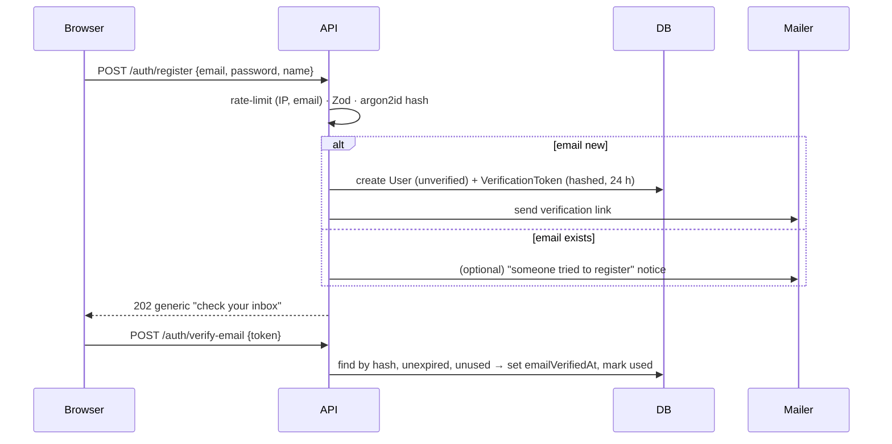

# Security Model

> **Sprint:** P01-S04 · **Owner:** `role-security-engineer` · **Status:** Draft for review (2026-10)
> Decisions: [ADR-005](../architecture/adr-005-auth-and-sessions.md) (auth), [ADR-006](../architecture/adr-006-tenant-isolation.md) (isolation), [ADR-002](../architecture/adr-002-realtime-engine.md) (socket auth). Roles: [rbac-matrix.md](rbac-matrix.md). Threats: [threat-model.md](threat-model.md).

## 1. Assets

| Asset | Sensitivity | Why |
| :--- | :--- | :--- |
| Test results (titles, error messages, stack traces) | **High** | Reveal source structure and internal URLs; may accidentally contain secrets from CI output |
| Comments, quarantine reasons | Medium–High | Internal engineering discussion |
| API keys, session tokens, OAuth tokens | **Critical** | Allow writing data or acting as a user |
| User identities (email, name) | Medium (PII) | Privacy obligations |
| Webhook secrets and target URLs | High | Allow forging events or SSRF pivots |
| Org membership and roles | High | Basis of all authorization |

## 2. Authentication flows

### 2.1 Register & verify



### 2.2 Login, refresh, reuse detection

```mermaid
sequenceDiagram
  participant B as Browser
  participant API
  participant DB
  B->>API: POST /auth/login
  API->>DB: verify argon2id; create Session(familyId, refreshHash)
  API-->>B: Set-Cookie tp_access (15m), tp_refresh (30d, Path=/api/v1/auth)
  Note over B,API: 15 min later
  B->>API: POST /auth/refresh (tp_refresh)
  API->>DB: find Session by hash
  alt valid & not rotated
    API->>DB: mark replaced; create new Session in same family
    API-->>B: new cookies
  else already rotated (reuse)
    API->>DB: revoke entire family
    API-->>B: 401, cookies cleared
  end
```

### 2.3 OAuth (Google, GitHub)

1. `GET /auth/oauth/:provider/start` creates `state` and a PKCE verifier, stores them in a short-lived, signed, `HttpOnly` cookie, and redirects to the provider.
2. Callback: validate `state` and exchange the code with the PKCE verifier. Fetch the profile; for GitHub, use **`/user/emails` for the primary verified email**.
3. Resolve the account: an existing `OAuthAccount` → sign in. Otherwise, if a user with that email exists, link **only if both emails are verified** (ADR-005 §8). Otherwise, if no user exists, create one with `emailVerifiedAt` set when the provider verified the email.
4. Issue the session cookies and redirect to `WEB_ORIGIN` + an allow-listed `returnTo` path (prevents open redirects).

### 2.4 Password reset

The request always returns a generic `202`. The token is 32 random bytes, stored hashed, single-use, and valid for 30 minutes. On confirmation, set the new password, **revoke all sessions**, and send a "your password was changed" email.

### 2.5 API keys (CI)

- Format: `tp_live_` + 32 random bytes (base62). Store `prefix` (first 8 characters after `tp_live_`) and `keyHash = sha256(key)`. A fast hash is fine for high-entropy secrets.
- Lookup: `systemDb.apiKey.findUnique({ keyHash })` → reject if revoked or expired → `tenantContext = { orgId, projectId, actor: { apiKeyId } }`.
- Scope: `/api/v1/ingest/*` only. All other routes ignore the `Authorization` header and require a session.
- `lastUsedAt` is written at most once per minute per key.

### 2.6 WebSocket tickets

`POST /realtime/ticket` (session) → random 32-byte ticket → `SET tp:ticket:<t> <userId> EX 60`. On connect: `GETDEL` → userId → join `user:{id}`. Project rooms require `join:project` with a membership check (ADR-002).

## 3. Authorization

- Roles are org-level; the permission map lives in `@testpulse/shared/src/permissions.ts` and is the single source for API guards and UI controls ([rbac-matrix.md](rbac-matrix.md)).
- Every request resolves `tenantContext` and then checks `can(role, action)`. Unknown or forbidden → 403. Resource outside the user's orgs → 404.
- Membership is read per request (not cached in the JWT), so role changes and removals take effect on the next request. Sockets are evicted proactively.

## 4. Tenant isolation

See ADR-006 (five layers). Code-review checklist for every PR touching data access:
- [ ] Uses `createTenantDb(request.tenantContext)`, or justifies `systemDb` in a comment.
- [ ] ID lookups include the tenant key (`findFirst({ where: { id, projectId } })`).
- [ ] Raw SQL includes the tenant predicate and has an isolation test.
- [ ] New route registered in the isolation table with its expected 404/403 behavior.
- [ ] Socket events and jobs carry tenant IDs and never leak across rooms.

## 5. Rate limiting (Redis-backed, `@fastify/rate-limit`)

| Category | Key | Initial limit (tune in P03-S06 / P04-S06) | On Redis outage |
| :--- | :--- | :--- | :--- |
| Login | IP **and** email | 10/min per IP; 5/15 min per email | Fail closed (503) |
| Register / resend / forgot | IP and email | 5/hour per email; 20/hour per IP | Fail closed |
| OAuth start/callback | IP | 30/min | Fail closed |
| Ingestion | API key **and** project | Sized for batching: ≥ 5 req/s per key, burst 20 | Fail **open** (CI safety; quota checks use the DB) |
| Authenticated REST | user | 600/min | Fail open with logging |
| Realtime ticket | user | 30/min | Fail closed |
| Webhook test / redeliver | project | 10/min | Fail closed |

The client IP comes from `x-forwarded-for` with `trustProxy` limited to the known proxy hops (Vercel rewrite → Render).

## 6. Web security

| Control | API (Fastify) | Web (Next.js 16) |
| :--- | :--- | :--- |
| CORS | Allow-list `WEB_ORIGIN` only, `credentials: true` | n/a |
| CSRF | `Origin` check on cookie-authenticated mutations + `SameSite=Lax` | Same-origin `/api` calls |
| Headers | `@fastify/helmet` (no CSP needed for JSON), `X-Content-Type-Options`, `Referrer-Policy` | Nonce-based CSP via `proxy.ts`: `default-src 'self'`; `connect-src 'self' <socket origin> <sentry>`; `frame-ancestors 'none'`; HSTS (production) |
| Untrusted content | Size caps; never interpolate into HTML | Render as text; strip ANSI; sanitize restricted Markdown (no raw HTML, `rel="noopener noreferrer nofollow"` on links, only http(s)/mailto) |
| Errors | Central handler maps to error codes; no stack traces or DB messages to clients | Error boundaries show a request ID |

## 7. Secrets management

- **Storage:** provider secret stores (GitHub Actions secrets, Render env, Vercel env). `.env.example` files contain placeholders only; `gitleaks` runs in CI.
- **Generation:** `node -e "console.log(require('crypto').randomBytes(32).toString('base64url'))"`.
- **Rotation:** every secret is rotated when moving to paid production (P10-S06). JWT secret rotation invalidates sessions (acceptable). Webhook secrets are rotatable per webhook.
- **Encryption at rest:** webhook secrets use AES-256-GCM with `WEBHOOK_SECRET_ENCRYPTION_KEY`, storing nonce + ciphertext + tag.
- **Logs:** pino `redact` covers `req.headers.authorization`, `req.headers.cookie`, `res.headers["set-cookie"]`, `*.password`, `*.token`, `*.apiKey`, `*.secret`.

## 8. Data lifecycle & privacy

| Data | Retention | Deletion |
| :--- | :--- | :--- |
| Test results and runs | Effective retention (plan-capped) | Retention job (chunked) |
| Daily aggregates | 365 days | Aggregation cleanup |
| Notifications | Read: 90 days | Cleanup job |
| Webhook deliveries | 30 days | Cleanup job |
| Sessions / tokens | Until expiry plus 7 days | Cleanup job |
| Audit events | Life of the org (purged with it) | Org purge |
| User account | Until the user deletes it | Anonymization (schema.md §5) |
| Org / project | Until deleted | Soft delete → async purge |

CI output may contain secrets. The reporter offers opt-in redaction of common token patterns (FR-REP-07), and the docs warn users not to print secrets in test output.
